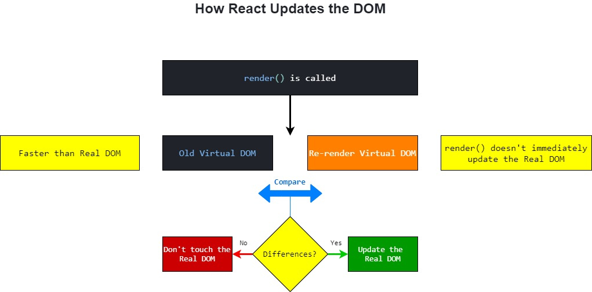

# React giải quết vấn đề như thế nào?

## Brief History of React

### Before React

### React Born

### React evolved

## React Philosophy

### Flat Component

### Functional Programing

### One way data flow

### Single source of truth

## How React work

### What is Virtual DOM

Trong React, với mỗi DOM object sẽ có một Virtual DOM object tương ứng. Một virtual DOM object là một virtual representation của một DOM object, có thể hiểu nôm na virtual DOM là một bản copy của DOM.

### How React update the DOM

Khi `render()` được gọi, nó không update real DOM, nó thực chất sẽ update lên virtual DOM. Sau đó, compare với một snapshot của old virtual DOM. Nếu có thay đổi React mới update lên Real DOM **chỉ và chỉ** những phần thay đổi. Nếu không thì chả có chuyện gì xảy ra cả.

Với cách này, nó cũng sẽ giúp tối ưu và hạn chế việc update real DOM không cần thiết.

## References

- [Design Principles
  ](https://reactjs.org/docs/design-principles.html)
- [Thinking in React](https://reactjs.org/docs/thinking-in-react.html)
- [The philosophy of React](https://code.likeagirl.io/the-philosophy-of-react-e2c126c61af3)
- [The Missing Introduction to React](https://medium.com/javascript-scene/the-missing-introduction-to-react-62837cb2fd76)
- [React philosophy](https://reallifeprogramming.com/react-philosophy-e8cdea991599)
